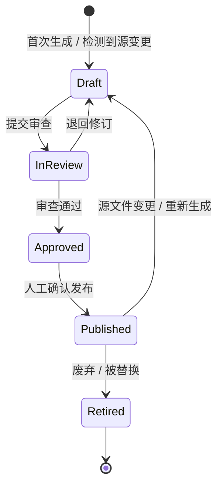
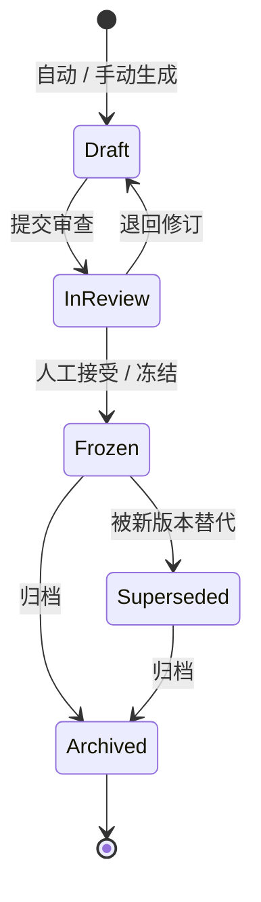
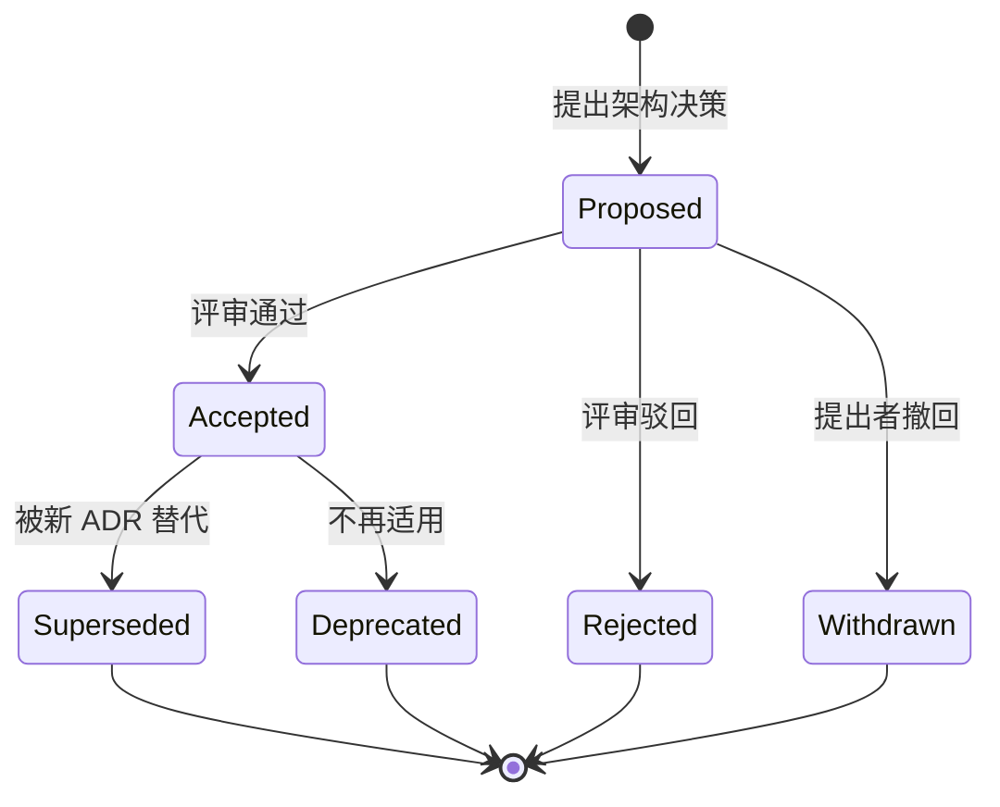

# DashVault 底层文档角色规范

> doc_id: dashvault.spec.document-roles
> spec_version: 1.0.0
> review_status: draft
> publication_status: unpublished
> 拆分自：specs/document-lifecycle.md 第六节

---

## 目录

1. [核心原则](#1-核心原则)
2. [底层文档角色](#2-底层文档角色)
3. [角色定义与区分](#3-角色定义与区分)
4. [生成触发规则：影响触发](#4-生成触发规则影响触发)
5. [段落级稳定 ID](#5-段落级稳定-id)
6. [存储结构](#6-存储结构)
7. [前端视图映射](#7-前端视图映射)
8. [角色视图映射表](#8-角色视图映射表)
9. [防"凑满九类"约束](#9-防凑满九类约束)
10. [角色与 doc_type 完整映射表](#10-角色与-doc_type-完整映射表)
11. [角色状态转换流程图](#11-角色状态转换流程图)

---

## 1. 核心原则

> "面线点"是前端视图，不是底层目录结构。底层文档按角色分类存储，前端按需组合成面/线/点视图。不为凑满九类而生成无实际价值的孤儿文档。

---

## 2. 底层文档角色

| # | 角色 | 标识 | 生命周期策略 | 典型 `doc_type` |
|---|------|------|------------|----------------|
| 1 | 项目宪章 | `charter` | 固定路径，低频原位更新 | `charter` |
| 2 | 当前状态 | `current_state` | 固定路径，高频原位更新 | `current_state` |
| 3 | 当前架构 | `architecture` | 固定路径，原位更新 | `current_architecture` |
| 4 | 当前术语 | `glossary` | 固定路径，原位更新 | `engineering_glossary` |
| 5 | 战略规划 | `strategy` | 原位更新 | `strategic`, `project_plan` |
| 6 | 阶段计划 | `phase_plan` | draft→frozen，人工接受后冻结 | `phase_plan` |
| 7 | 阶段报告 | `phase_report` | 不可变记录 | `phase_report` |
| 8 | ADR | `adr` | 状态机 | `adr` |
| 9 | 方法论 | `methodology` | 原位更新 | `methodology` |
| 10 | 快速参考 | `reference` | 原位更新 | `quick_reference` |
| 11 | 复盘总结 | `retrospective` | 不可变记录 | `retrospective` |
| 12 | 不可变分析 | `analysis_snapshot` | 不可变记录 | `incident_report`, `experiment_log` |
| 13 | 持续分析 | `current_topic` | 原位更新 | `component_deep_dive`, `pipeline_walkthrough` |
| 14 | 变更摘要 | `change_summary` | 不可变记录 | `change_summary` |

---

## 3. 角色定义与区分

### 3.1 项目宪章 vs 当前状态

| 维度 | `charter` | `current_state` |
|------|----------|----------------|
| **回答什么** | 项目为什么存在、长期边界是什么、不做的事 | 项目当前在哪个 Phase、什么状态、有什么问题 |
| **更新频率** | 极少（项目方向变化时） | 每次同步 |
| **典型内容** | 产品定位、能力边界、安全硬边界、不可协商的约束 | 当前 Phase、关键度量、已知风险、未解决问题 |
| **来源** | AGENTS.md 的"角色定义"和"能力边界"章节 | 代码树、最新提交、PROJECT_STATUS.md |
| **是否可自动生成** | 否，首次必须人工编写，后续仅提示差异 | 是，但首次发布需人工确认 |

### 3.2 阶段计划：draft→frozen

```
阶段计划生命周期：
  draft ─→ in_review ─→ frozen ─→ executed ─→ archived
              ↓
           rejected ─→ draft（重新修订）
```

- `draft`：计划草稿，可修订，DashVault 可覆盖更新
- `in_review`：已提交审查，不可自动覆盖
- `frozen`：人工接受，内容冻结，后续修订通过新增文件或修正附录
- `executed`：Phase 执行完毕
- `archived`：计划已归档

### 3.3 analysis 拆分

| 维度 | `analysis_snapshot`（不可变） | `current_topic`（持续更新） |
|------|--------------------------|--------------------------|
| **适用场景** | 事故复盘、实验记录、一次性深度分析 | 组件深度解析、链路全览、长期跟踪主题 |
| **生命周期** | 时间戳文件，写入后不修改 | 固定路径，随代码演进持续更新 |
| **命名** | `incident-silver-data-drift_20260723_1530.md` | `compiler-pipeline-walkthrough.md` |
| **证据要求** | verified | supported |

---

## 4. 生成触发规则：影响触发

每次同步的流程：

```
同步触发
  └→ scanner 采集变更文件列表
       └→ 对每份当前权威文档：
            ├─ 计算依赖文件集（该文档生成时读取了哪些文件）
            ├─ 对比 evidence_manifest 中的文件哈希
            ├─ 无变化 → 跳过，标记"未过期"
            └─ 有变化 → 生成 draft，进入审查队列
```

各角色的自动发布权限：

| 角色 | 自动生成 draft | 自动发布 | 规则 |
|------|:--:|:--:|------|
| `charter` | ✅ | ❌ | 差异小于阈值可自动生成 draft，必须人工确认后发布 |
| `current_state` | ✅ | ❌ | 同上 |
| `architecture` | ✅ | ❌ | 同上 |
| `glossary` | ✅ | ❌ | 新增术语 draft 必须人工确认；已发布术语原位更新可自动 |
| `strategy` | ❌ | ❌ | 纯手动触发 |
| `phase_plan` | ✅ | ❌ | 仅 `draft` 状态可自动更新 |
| `phase_report` | ✅ | ❌ | 自动生成 draft，人工确认后 frozen |
| `adr` | ❌ | ❌ | 纯手动触发 |
| `methodology` | ❌ | ❌ | 纯手动触发 |
| `reference` | ✅ | ⚠️ | 自动生成 draft，每条规则独立人工确认 |
| `retrospective` | ❌ | ❌ | 纯手动触发 |
| `analysis_snapshot` | ✅ | ❌ | 自动生成 draft，人工确认后 frozen |
| `current_topic` | ✅ | ⚠️ | 可自动更新，但差异部分需标记为 `inferred` 待确认 |
| `change_summary` | ✅ | ✅ | 纯机器产出，可自动发布 |

---

## 5. 段落级稳定 ID

### 5.1 术语 ID

```yaml
# glossary 文档内，每个术语的 Front Matter
---
term_id: "datadev.term.SqlBuildPlan"      # 全局唯一
term_name: "SqlBuildPlan"
term_version: 3
---
```

### 5.2 规则 ID

```yaml
# reference 文档内，每条铁律/规则的 Front Matter
---
rule_id: "datadev.rule.001"                # 项目内唯一
rule_name: "数据库设计文档是唯一事实源"
rule_category: "铁律"
rule_version: 1
---
```

### 5.3 通用段落锚点

```markdown
## <a id="sec-compiler-pipeline"></a> 编译器管道

引用：[编译器管道](dashvault://doc/datadev.compiler-pipeline-walkthrough#sec-compiler-pipeline)
```

锚点规则：
- 必须显式声明 `id`，不依赖自动生成的标题锚点
- `id` 格式：`sec-{kebab-case}`
- 删除章节时对应的 `id` 不得复用

---

## 6. 存储结构

```
DashVault/docs/
├── datadev-v3/
│   ├── charter/
│   │   ├── project-charter.md         ← 项目宪章
│   │   └── current-state.md           ← 当前状态
│   ├── architecture/
│   │   └── current-architecture.md
│   ├── glossary/
│   │   └── engineering-glossary.md
│   ├── strategy/
│   │   └── strategic.md
│   ├── phases/
│   │   ├── phase-0-bootstrap-plan.md
│   │   └── phase-0-bootstrap-report.md
│   ├── adrs/
│   │   └── adr-001-duckdb-compiler.md
│   ├── topics/                        ← current_topic
│   │   └── compiler-pipeline-walkthrough.md
│   ├── snapshots/                     ← analysis_snapshot
│   │   └── incident-silver-data-drift_20260723_1530.md
│   ├── references/
│   │   └── quick-reference.md
│   ├── retrospectives/
│   │   └── phase-0-5-retrospective.md
│   └── changes/
│       ├── change-summary_20260723_1530.md
│       └── change-summary_20260730_0900.md
├── tianshu/
│   └── ...
├── text2sql/
│   └── ...
├── text2sql-lite/
│   └── ...
└── cross-project/
    ├── methodology/
    └── topics/

DashVault/_evidence/                    ← 机器工件，与知识文档分离
├── manifest-01J3R7XK.json
└── ...
```

---

## 7. 前端视图映射

### 7.1 面（全局视图）

```
面 视图
├── 项目全景
│   ├── charter + current_state         ← 项目的"宪法"和"当前状态"
│   ├── architecture                    ← 架构全貌
│   ├── strategy + project_plan         ← 战略方向
│   └── retrospective                   ← 项目级总结
│
├── 术语全景
│   └── glossary                        ← 当前有效的全部术语
│
└── 方法论库（跨项目）
    └── methodology                     ← 跨项目可复用方法
```

### 7.2 线（演进视图）

```
线 视图
├── 阶段演化线
│   └── phase-plans + phase-reports（按时间排列）
│
├── 决策演化线
│   └── ADRs（按状态排列）：proposed → accepted → superseded
│
├── 变更时间线
│   └── change-summaries（按时间排列）
│
└── 专题分析线
    └── analysis_snapshots + current_topics
```

### 7.3 点（知识点视图）

```
点 视图
├── 术语节点        ← glossary 中单个术语（term_id）
├── 决策节点        ← 单个 ADR
├── 组件/模块节点   ← current_topic 中的组件分析
├── 风险/故障节点   ← analysis_snapshot 中的复盘分析
├── 方法论节点      ← methodology 中的单个方法
├── 铁律节点        ← reference 中的单条铁律（rule_id）
└── 速查节点        ← reference 中的单条速查
```

---

## 8. 角色视图映射表

| 底层角色 | 面 | 线 | 点 | 点粒度锚点 |
|---------|:--:|:--:|:--:|-----------|
| `charter` | ✅ | ❌ | ❌ | — |
| `current_state` | ✅ | ❌ | ❌ | — |
| `architecture` | ✅ | ❌ | ❌ | `#sec-*` 锚点 |
| `glossary` | ✅ | ❌ | ✅ | `term_id` |
| `strategy` | ✅ | ❌ | ❌ | — |
| `phase_plan` | ❌ | ✅ | ❌ | — |
| `phase_report` | ❌ | ✅ | ❌ | — |
| `adr` | ❌ | ✅ | ✅ | `adr_NNN` |
| `methodology` | ✅ | ❌ | ✅ | `#sec-*` 锚点 |
| `reference` | ❌ | ❌ | ✅ | `rule_id` |
| `retrospective` | ✅ | ❌ | ❌ | — |
| `analysis_snapshot` | ❌ | ✅ | ✅ | `#sec-*` 锚点 |
| `current_topic` | ❌ | ✅ | ✅ | `#sec-*` 锚点 |
| `change_summary` | ❌ | ✅ | ❌ | — |

---

## 9. 防"凑满九类"约束

后台判空检查：如果 `scanner` 未找到证据支持生成某份文档，则标记为 **"无证据，跳过"**，不强行生成无内容的孤儿文档。前端同理：无内容的视图自动折叠。

---

## 10. 角色与 doc_type 完整映射表

下表将 14 种文档角色统一映射到 面/线/点 三维视图，并标注每个角色对应的生命周期策略。此表是前端视图渲染和后端生命周期管理的单一事实源。

| # | 角色 | 标识 | 典型 `doc_type` | 面视图 | 线视图 | 点视图 | 生命周期策略 |
|---|------|------|-----------------|:-----:|:-----:|:-----:|------------|
| 1 | 项目宪章 | `charter` | `charter` | ✅ | ❌ | ❌ | 原位更新（固定路径，低频） |
| 2 | 当前状态 | `current_state` | `current_state` | ✅ | ❌ | ❌ | 原位更新（固定路径，高频） |
| 3 | 当前架构 | `architecture` | `current_architecture` | ✅ | ❌ | ❌ | 原位更新（固定路径） |
| 4 | 当前术语 | `glossary` | `engineering_glossary` | ✅ | ❌ | ✅ | 原位更新（固定路径） |
| 5 | 战略规划 | `strategy` | `strategic`, `project_plan` | ✅ | ❌ | ❌ | 原位更新 |
| 6 | 阶段计划 | `phase_plan` | `phase_plan` | ❌ | ✅ | ❌ | draft→frozen |
| 7 | 阶段报告 | `phase_report` | `phase_report` | ❌ | ✅ | ❌ | 不可变记录 |
| 8 | ADR | `adr` | `adr` | ❌ | ✅ | ✅ | ADR 状态机 |
| 9 | 方法论 | `methodology` | `methodology` | ✅ | ❌ | ✅ | 原位更新 |
| 10 | 快速参考 | `reference` | `quick_reference` | ❌ | ❌ | ✅ | 原位更新 |
| 11 | 复盘总结 | `retrospective` | `retrospective` | ✅ | ❌ | ❌ | 不可变记录 |
| 12 | 不可变分析 | `analysis_snapshot` | `incident_report`, `experiment_log` | ❌ | ✅ | ✅ | 不可变记录 |
| 13 | 持续分析 | `current_topic` | `component_deep_dive`, `pipeline_walkthrough` | ❌ | ✅ | ✅ | 原位更新 |
| 14 | 变更摘要 | `change_summary` | `change_summary` | ❌ | ✅ | ❌ | 不可变记录 |

### 10.1 生命周期策略说明

**原位更新（Current View）**：文档在固定路径下保存，内容随源文件变更而更新；每次新版本取代旧版本，不保留历史记录（或通过 VCS 间接保留）。适用于持续反映当前状态的文档，如宪章、当前架构、术语表等。

**不可变记录（Immutable Record）**：文档在 draft→frozen→archived 路径中流转，一旦 frozen 即不可修改；历史版本通过时间戳文件名保留。适用于复盘、报告、变更摘要等写入后不应更改的文档。

**ADR 状态机（ADR State Machine）**：文档在 proposed→accepted→superseded/deprecated/rejected/withdrawn 状态间流转；不同状态决定了文档在视图中的可见性和排序。适用于架构决策记录。

---

## 11. 角色状态转换流程图

### 11.1 原位更新（Current View）生命周期

适用于：`charter`、`current_state`、`architecture`、`glossary`、`strategy`、`methodology`、`reference`、`current_topic`



**状态说明**：
- `Draft`：草稿状态，DashVault 可自动覆盖更新
- `InReview`：已提交审查，禁止自动覆盖
- `Approved`：审查通过，等待人工发布确认
- `Published`：已发布，对前端可见；源文件变更时回到 Draft 重新生成
- `Retired`：废弃/被替换，不再出现在前端视图中

### 11.2 不可变记录（Immutable Record）生命周期

适用于：`phase_report`、`retrospective`、`analysis_snapshot`、`change_summary`，以及 `phase_plan`（其 draft→frozen 为此策略的特例）



**状态说明**：
- `Draft`：草稿，可修订
- `InReview`：审查中，不可自动覆盖
- `Frozen`：已冻结，内容不可修改。如需修正，通过发布新版本实现
- `Superseded`：被更新版本取代，旧版本保留以供追溯
- `Archived`：归档，不再在活跃视图中展示

### 11.3 ADR 状态机生命周期

适用于：`adr`



**状态说明**：
- `Proposed`：已提出，等待评审。前端视图按时间倒序展示，带"待定"标记
- `Accepted`：评审通过，成为有效决策。前端线视图中高亮显示
- `Rejected`：评审驳回，记录留存供参考
- `Withdrawn`：提出者自行撤回
- `Superseded`：被更新的 ADR 替代，旧 ADR 中标注引用关系
- `Deprecated`：不再适用，无需替代方案

### 11.4 三种生命周期对比

| 维度 | 原位更新 | 不可变记录 | ADR 状态机 |
|------|---------|-----------|-----------|
| **文件路径** | 固定路径 | 时间戳文件名 | 有序编号文件名 |
| **历史保留** | VCS 间接保留 | 显式保留（多文件） | 显式保留（多文件） |
| **状态数量** | 5（Draft→InReview→Approved→Published→Retired） | 6（Draft→InReview→Frozen→Superseded→Archived） | 6（Proposed→Accepted→Rejected→Withdrawn→Superseded→Deprecated） |
| **自动回退** | Published → Draft（源变更触发） | 无（Frozen 即锁定） | 无（状态单向流转） |
| **适用场景** | 持续反映当前状态的知识文档 | 一次性写入、事后不修改的记录 | 需追踪决策演化的技术选型 |

---

> 本文档由 `specs/document-lifecycle.md` 第六节拆分而来，保持与原文档内容一致，并在此基础上补充了完整映射表和状态转换图。
