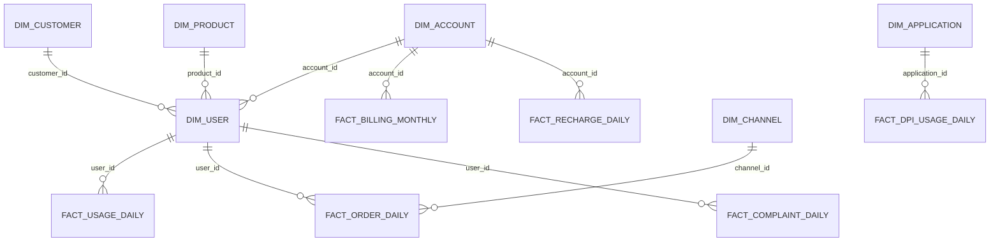

# 数据模型设计

## 建模目标

本项目采用接近企业级数仓的分层建模方式，以 MySQL schema 作为分层边界：`ods`、`dwd`、`dws`、`ads`。模型设计优先服务以下能力：

- 保留源业务粒度，便于追溯。
- 建立稳定的用户、客户、账户、产品、渠道和组织维度。
- 支持账单、缴费、使用、订单、投诉、DPI 等事实分析。
- 为指标解释、SQL 生成、业务问答和 Agent 工具调用提供清晰语义。

## 分层职责

| 层级 | schema | 职责 | 典型表 |
|---|---|---|---|
| ODS | `ods` | 接入层，承载模拟源业务数据，尽量保留来源粒度 | `ods.ods_user_profile_daily`、`ods.ods_recharge_daily` |
| DWD | `dwd` | 明细层，清洗主外键、时间、枚举和事实粒度 | `dwd.dim_user`、`dwd.fact_billing_monthly` |
| DWS | `dws` | 汇总层，按用户、产品、渠道、组织和账期沉淀宽表 | `dws.dws_user_month_summary` |
| ADS | `ads` | 应用层，服务指标、报表、Agent 语义查询 | `ads.ads_kpi_revenue_monthly` |

## 主题域

| 主题域 | 说明 | 核心实体 |
|---|---|---|
| 客户用户 | 客户、用户、账户和生命周期 | `customer_id`、`user_id`、`account_id` |
| 产品套餐 | 套餐、产品、订购关系和资费 | `product_id`、`package_id` |
| 计费账务 | 出账、应收、欠费、缴费和回款 | `bill_id`、`payment_id` |
| 使用行为 | 流量、语音、短信和 DPI 应用使用 | `usage_date`、`application_id` |
| 渠道订单 | APP、营业厅、客服、电渠等订单办理 | `order_id`、`channel_id` |
| 服务投诉 | 投诉工单、问题类型、处理状态和满意度 | `complaint_id` |
| 组织人员 | 归属组织、发展人、处理员工 | `org_id`、`staff_id` |

## DWD 维度表

| 表名 | 中文名称 | 粒度 | 主要用途 |
|---|---|---|---|
| `dwd.dim_user` | 用户维度表 | 一用户一行 | 用户画像、生命周期、地域、套餐关联 |
| `dwd.dim_customer` | 客户维度表 | 一客户一行 | 客户基础信息和实名主体 |
| `dwd.dim_account` | 账户维度表 | 一账户一行 | 出账、缴费和欠费归集 |
| `dwd.dim_product` | 产品维度表 | 一产品一行 | 套餐档位、月租、5G 类型 |
| `dwd.dim_channel` | 渠道维度表 | 一渠道一行 | 订单、缴费、营销触点分析 |
| `dwd.dim_org` | 组织维度表 | 一组织一行 | 地市、区县、营业组织分析 |
| `dwd.dim_staff` | 员工维度表 | 一员工一行 | 发展人、处理人、服务分析 |
| `dwd.dim_terminal` | 终端维度表 | 一终端型号一行 | 终端销售和终端偏好分析 |
| `dwd.dim_date` | 日期维度表 | 一日期一行 | 日、月、季度、节假日分析 |
| `dwd.dim_application` | 应用维度表 | 一应用一行 | DPI 应用流量分析 |

## DWD 事实表

| 表名 | 中文名称 | 粒度 | 主要度量 |
|---|---|---|---|
| `dwd.fact_user_snapshot_daily` | 用户日快照事实表 | 一用户一日 | 在网状态、欠费状态、风险标志 |
| `dwd.fact_usage_daily` | 用户使用日事实表 | 一用户一日 | 流量、语音、短信 |
| `dwd.fact_billing_monthly` | 月账单事实表 | 一账户一账期 | 出账金额、套餐费、优惠费 |
| `dwd.fact_recharge_daily` | 缴费日事实表 | 一笔缴费 | 缴费金额、渠道、支付状态 |
| `dwd.fact_order_daily` | 订单日事实表 | 一笔订单 | 订单金额、支付时间、业务时间 |
| `dwd.fact_complaint_daily` | 投诉日事实表 | 一笔投诉 | 投诉类型、处理时长、满意度 |
| `dwd.fact_dpi_usage_daily` | DPI 应用使用事实表 | 一用户一应用一日 | 应用流量 |

## 汇总与应用模型

| 表名 | 中文名称 | 说明 |
|---|---|---|
| `dws.dws_user_day_summary` | 用户日汇总表 | 用户日级使用、缴费、状态汇总 |
| `dws.dws_user_month_summary` | 用户月汇总表 | 用户月级 ARPU、流量、风险标签 |
| `dws.dws_product_month_summary` | 产品月汇总表 | 套餐用户数、收入、使用量 |
| `dws.dws_channel_day_summary` | 渠道日汇总表 | 渠道订单和缴费表现 |
| `dws.dws_org_month_summary` | 组织月汇总表 | 地域和组织经营表现 |
| `dws.dws_arrears_month_summary` | 欠费月汇总表 | 欠费用户和欠费金额 |
| `dws.dws_complaint_day_summary` | 投诉日汇总表 | 投诉量、处理效率、满意度 |
| `dws.dws_dpi_app_day_summary` | 应用日汇总表 | 应用流量排行 |
| `ads.ads_kpi_user_overview_monthly` | 用户总览指标表 | 用户规模和结构指标 |
| `ads.ads_kpi_revenue_monthly` | 收入指标表 | 收入、缴费、ARPU |
| `ads.ads_kpi_arrears_monthly` | 欠费指标表 | 欠费用户数和欠费金额 |
| `ads.ads_agent_metric_catalog` | Agent 指标目录 | 指标名称、口径、推荐 SQL 入口 |
| `ads.ads_agent_field_catalog` | Agent 字段目录 | 字段语义、表归属、可查询属性 |
| `ads.ads_agent_semantic_join` | Agent 语义关联表 | 表间关联关系和连接条件 |

## 主外键关系

## 建模约束

- 业务时间必须处于用户入网和离网时间之间。
- 订单支付时间必须晚于或等于订单创建时间。
- DWD 明细层不应凭空多于 ODS 来源层，除非有明确的一拆多业务规则。
- ADS 层只沉淀面向查询和分析的指标，不替代 DWD 明细事实。
- Agent 生成 SQL 时必须优先使用标准字段名和中文注释，不直接依赖源系统字段名。
