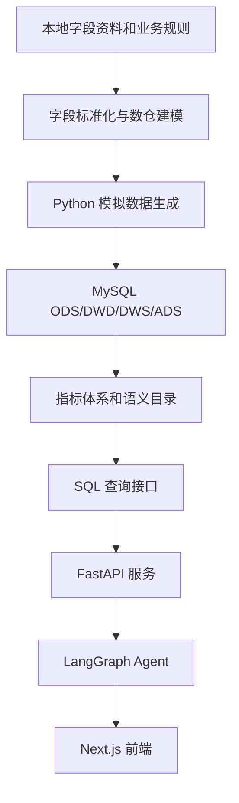

# 系统架构设计

## 总体目标

系统目标是建设一个本地可运行的电信业务数据仓库实验室，并逐步扩展为支持指标查询、SQL 生成、业务解释和智能分析的 Agent 应用。

## 技术选型

| 模块 | 推荐技术 | 选择理由 |
|---|---|---|
| 数据库 | MySQL 8.x | 本地安装简单，SQL 训练价值高，适合个人电脑承载千万级模拟数据 |
| 数据生成 | Python | 易于表达业务规则、分布模型和数据质量校验 |
| ETL | Python + SQL | 便于拆分 ODS 到 DWD、DWS、ADS 的加工逻辑 |
| API | FastAPI | 查询接口轻量、类型清晰、适合和 Agent 工具集成 |
| Agent | LangGraph | 适合构建可控的 SQL 生成、指标解释和多步骤分析流程 |
| 前端 | Next.js | 适合建设指标看板、SQL 工作台和 Agent 对话界面 |
| 配置 | YAML + `.env` | 配置和凭据分离，便于本地与后续部署切换 |

## 目录职责

| 目录 | 职责 |
|---|---|
| `config/` | 保存项目、数据库、Agent 和运行参数配置 |
| `docs/` | 保存业务背景、字段字典、指标字典、模型设计、架构和项目状态 |
| `data/raw/` | 保存本地原始资料，不进入 Git |
| `data/generated/` | 保存模拟数据落盘文件，不进入 Git |
| `data/logs/` | 保存数据质量报告和运行日志 |
| `sql/` | 保存建库建表、分层加工、校验 SQL |
| `src/telecom_dw/` | 保存 Python 工程代码 |
| `src/frontend/` | 预留 Next.js 前端目录 |
| `tests/` | 保存数据质量、指标、SQL、API 和 Agent 测试 |

## 配置文件说明

| 文件 | 说明 |
|---|---|
| `config/settings.yaml` | 项目级总配置，包含分层库名、生成规模、质量规则和路径 |
| `config/database.yaml` | MySQL 连接和连接池参数，密码应优先从环境变量读取 |
| `config/agent.yaml` | Agent 工具、SQL 安全规则、默认查询限制和解释策略 |
| `.env.example` | 本地环境变量模板，不包含真实密钥 |

## 后端服务规划

FastAPI 建议拆为四类接口：

| 接口类型 | 说明 | 示例 |
|---|---|---|
| 元数据接口 | 查询库、表、字段、主外键和中文注释 | `/metadata/tables` |
| 指标接口 | 查询指标定义、口径和推荐来源表 | `/metrics/catalog` |
| SQL 接口 | 执行白名单 SQL、解释 SQL、返回查询结果 | `/sql/query` |
| Agent 接口 | 接收自然语言问题并返回分析结果 | `/agent/chat` |

## Agent 规划

Agent 必须遵守以下规则：

- 优先使用 `docs/metric_dictionary.md` 和 ADS 语义目录。
- SQL 默认只读，不允许生成 DDL、DML、删除或修改语句。
- 查询必须包含合理的时间范围和 `LIMIT`。
- 回答必须说明指标口径、数据来源和过滤条件。
- 遇到口径不明确的问题，应先追问或给出可选口径。

## 本地性能建议

- 千万级模拟数据保留在 MySQL，本地文件只作为可再生成缓存。
- 批量入库优先使用 `LOAD DATA LOCAL INFILE`。
- 大表按时间字段、用户字段、账户字段建立组合索引。
- ADS 查询接口默认读取汇总表，避免直接扫明细大表。
- Agent SQL 执行层设置超时、行数限制和只读账号。
